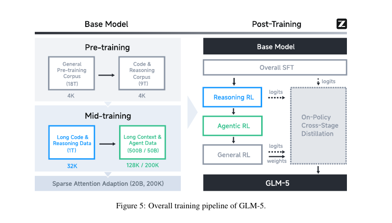
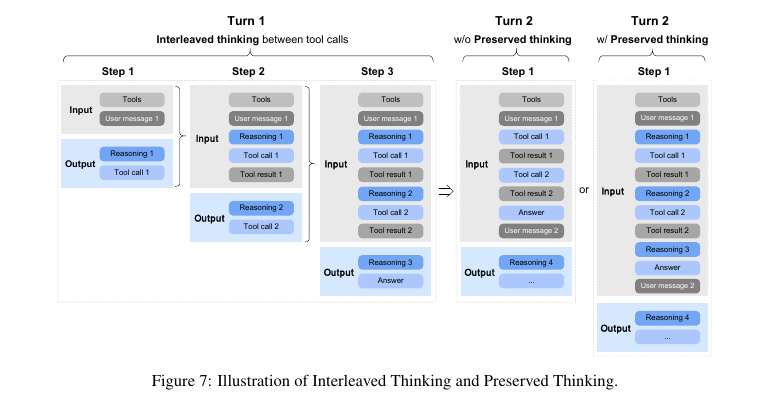
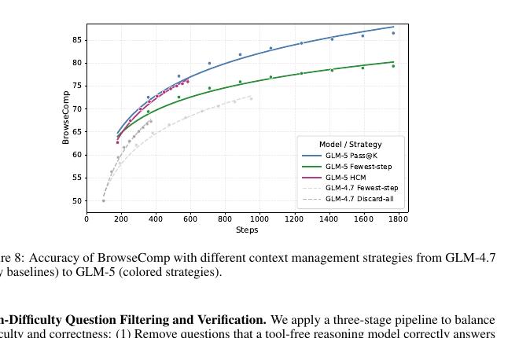
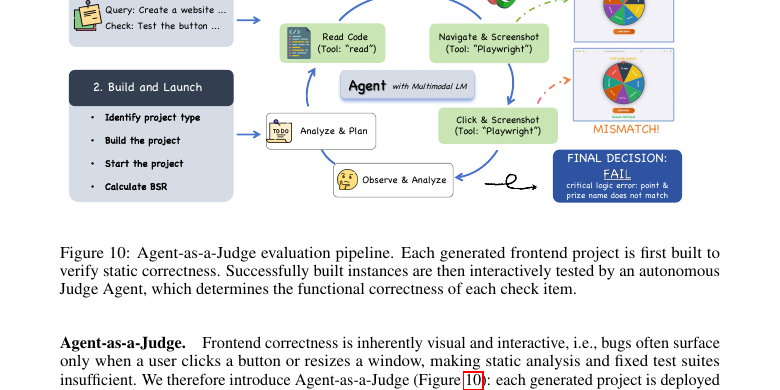
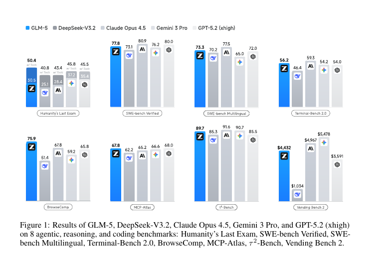

> **论文**：GLM-5: from Vibe Coding to Agentic Engineering  
> **作者**：GLM-5 Team, Zhipu AI & Tsinghua University  
> **版本**：arXiv:2602.15763v2, 2026-02-24  
> **代码/模型**：https://github.com/zai-org/GLM-5  
> **阅读时长**：约 25 分钟  
> **难度**：⭐⭐⭐⭐ (需要理解 MoE、长上下文、RLHF/GRPO、Agent 评测)  
> **前置知识**：Transformer/MoE、MLA/GQA、强化学习后训练、代码 Agent、长上下文推理

## TL;DR

GLM-5 的重点不是单纯把模型做大，而是把“人提示模型写代码”的 vibe coding 推向“模型自己规划、调用工具、修改工程、验证结果”的 agentic engineering。技术路径由三块组成：744B/40B active 的 MoE 基座、DSA 稀疏注意力降低长上下文成本、面向长轨迹 agent 的异步 RL 与可验证工程环境。

## 论文概述

**问题**：代码模型在静态 benchmark 上越来越强，但真实软件工程需要长时间探索仓库、调用工具、执行测试、修复错误，训练和评测都比单轮生成复杂得多。

**方案**：GLM-5 从预训练、后训练、RL 基础设施、agent 环境构建到硬件部署做整套系统升级：先训练长上下文 MoE 基座，再通过 Reasoning RL、Agentic RL、General RL 和跨阶段蒸馏把能力对齐到真实工作流。

**主要贡献**：

1. 使用 DSA (DeepSeek Sparse Attention) 继续预训练，把 200K 级上下文的训练/推理成本压下来，同时尽量保持 dense attention 的长程检索能力。
2. 构建异步 agent RL 体系：训练引擎和 rollout 引擎解耦，用 TITO、双侧 importance clipping、样本丢弃、DP-aware routing 处理异步 off-policy 和长尾延迟。
3. 将“工程能力”做成可训练、可评测对象：超过 10K 个可验证 SWE/terminal 环境，搜索 agent 多跳 QA 合成，CC-Bench-V2 覆盖前端、后端、长链任务。

## 背景与动机

“Vibe coding” 的典型流程是：用户用自然语言描述需求，模型输出一段代码，人类负责粘贴、运行、调试、判断是否正确。这个范式对短任务有效，但遇到真实工程会暴露三个瓶颈。

第一，任务不是一次生成，而是一串行动。模型要读仓库、定位文件、理解依赖、改代码、跑测试、根据错误继续修。每一步都会改变环境状态，后续决策依赖前面留下的上下文。

第二，长上下文不是免费午餐。Agent 轨迹包含工具调用、日志、文件片段、测试输出，动辄超过 100K tokens。Dense attention 的 $O(L^2)$ 成本让训练和 rollout 都很贵；简单截断又会丢失关键证据。

第三，训练 RL agent 的瓶颈不是平均吞吐，而是长尾轨迹。同步 RL 中一个特别慢的 sandbox、一次特别长的多轮搜索、一次卡住的测试执行，都可能让整批 GPU 等待。

GLM-5 的论文围绕这些问题展开。它把模型能力提升写成一条“系统链路”：模型结构降低成本，数据提高长任务覆盖，RL 让模型学会行动，环境让行动可验证，评测检查真实工程闭环。

## 核心方法

### 整体训练流程



**图示内容**：GLM-5 的训练分为 Base Model 和 Post-Training 两部分。基座先经过 4K 预训练、32K/128K/200K mid-training，再做 20B tokens 的 sparse attention adaptation；后训练阶段依次进行 SFT、Reasoning RL、Agentic RL、General RL，并通过 On-Policy Cross-Stage Distillation 缓解能力遗忘。

**数据流**：

```text
通用/代码/推理语料 -> 长上下文 mid-training -> DSA 适配
    -> Overall SFT -> Reasoning RL -> Agentic RL -> General RL
    -> On-Policy Cross-Stage Distillation -> GLM-5
```

这里的关键不是某一个训练阶段，而是阶段之间的分工：

- Pre-training 建立通用语言、代码、推理底座。
- Mid-training 把上下文窗口逐步扩到 32K、128K、200K，并增加 repo、issue、PR、长文档和 agent 轨迹。
- Sparse Attention Adaptation 把 dense/MLA 基座迁移到 DSA，让长上下文成本下降。
- SFT 引入工具调用、代码 agent、搜索 agent、interleaved thinking 等行为格式。
- Reasoning RL 继续强化数学、科学、代码和工具辅助推理。
- Agentic RL 针对长轨迹工程/搜索任务训练行动策略。
- General RL 修正通用对话、指令遵循、情绪表达和任务质量。
- Cross-stage distillation 把前面阶段学到的技能重新拉回同一个最终模型，避免“越训越偏”。

### 1. 模型结构：更大的 MoE，但 active 参数只小幅增加

GLM-5 是 MoE 模型，总参数从 GLM-4.5 的 355B 扩到 744B，active 参数从 32B 到 40B。论文附录给出的结构变化如下：

| 项目 | GLM-4.5 | GLM-5 |
|---|---:|---:|
| Total parameters | 355B | 744B |
| Activated parameters | 32B | 40B |
| Dense layers | 3 | 3 |
| MoE layers | 89 | 75 |
| Hidden dim | 5120 | 6144 |
| Attention heads | 96 | 64 |
| Total experts | 160 | 256 |
| Routed experts | 8 | 8 |
| Vocab size | 151552 | 154880 |

这个设计体现了一个取舍：参数容量大幅增加，但每 token 激活的计算量没有同步翻倍。256 experts 提供更高容量，75 个 MoE 层和 80 层总深度降低专家并行通信开销。对工程 agent 来说，这很现实：它们经常跑超长轨迹，推理成本和延迟会直接决定产品可用性。

### 2. MLA + Muon Split：先解决长上下文 KV 存储，再修训练稳定性

GLM-5 使用 MLA (Multi-latent Attention) 来压缩 KV cache。直觉上，MLA 把 key/value 映射到更低维的 latent 表示，目标是在长上下文中省显存、提速。

论文发现一个细节：直接使用 576 维 latent KV-cache 的 MLA，在 Muon optimizer 下不如 GQA-8 稳。为补齐差距，GLM-5 修改 Muon 的矩阵正交化方式：

- 原始做法：对多头 $Q/K/V$ 的 up-projection 矩阵整体做正交化。
- Muon Split：按 head 拆成更小矩阵，分别做正交化。

这样每个 attention head 的投影权重可以按不同尺度更新。Table 1 中，MLA 在 BBH/HumanEval 上明显弱于 GQA-8，加入 Muon Split 后整体追近；GLM-5 还把 head dimension 从 192 增到 256、attention heads 减少三分之一，使训练/prefill 计算和参数数基本不变，但 decoding 点积成本下降。

### 3. DSA：把长上下文 attention 从“全看”改成“按内容检索”

DSA (DeepSeek Sparse Attention) 是 GLM-5 降低长上下文成本的核心。传统 dense attention 对长度 $L$ 的序列需要 $O(L^2)$ 计算；在 128K/200K 级别，这会成为训练和 agent rollout 的硬瓶颈。

DSA 的直觉是：并不是每个 token 都需要 attend 到所有历史 token。对于某个 query，只选出最相关的 top-k KV 条目参与 attention。它不是固定窗口，也不是简单隔点采样，而是让 indexer 按内容动态选择。

可以把 DSA 写成一个抽象过程：

```python
def dsa_attention(q, k_cache, v_cache, indexer, k_top=2048):
    # 1. indexer 估计 query 与历史 KV 的相关性
    scores = indexer(q, k_cache)

    # 2. 只取最相关的 top-k token
    idx = topk(scores, k_top)
    k_sparse = gather(k_cache, idx)
    v_sparse = gather(v_cache, idx)

    # 3. 在稀疏集合上做标准 attention
    return attention(q, k_sparse, v_sparse)
```

论文强调 DSA 是从 dense base model 继续训练迁移过来的，不是从头训练稀疏模型。GLM-5 的 DSA 适配包含两步：

1. **Warm-up**：1000 steps，每步 14 条 202,752 tokens 序列，最大学习率 $5e^{-3}$，主要让 indexer 学会选择。
2. **Sparse adaptation**：沿用 mid-training 数据和超参，训练 20B tokens，常数学习率 $1e^{-5}$。

结果上，DSA 和 MLA 在 128K 长上下文任务上接近：MQ-NIAH 都是 100.0，MV-NIAH DSA 97.0 高于 MLA 95.5，SQuAD-128K DSA 86.0 高于 MLA 79.7，HotpotQA-128K DSA 63.0 低于 MLA 66.3。论文给出的工程收益是长序列 attention 计算约降低 1.5-2 倍。

#### 为什么不用简单 Sliding Window？

论文做了 GLM-9B 上的对比。固定交替的 SWA Interleave 在 RULER@128K 从 full attention 的 75.28 掉到 6.51，几乎崩掉。搜索得到的 SWA Pattern 好很多，但 RULER@128K 仍只有 53.95。GDN/SimpleGDN 也有不同程度损失。

原因很直接：工程任务和多跳搜索的关键证据可能出现在任意位置。固定窗口假设“近处更重要”，但真实 agent 日志中，第一次打开的文件、早期测试错误、用户原始约束，可能在几十轮之后仍然关键。DSA 的内容检索比固定窗口更适合这种长程依赖。

### 4. MTP 参数共享：提升 speculative decoding 的接受长度

GLM-5 继续使用 MTP (Multi-token Prediction) 作为 speculative decoding 的 draft 模型。普通 MTP 如果预测未来 $n$ 个 token，训练时需要 $n$ 个 MTP 层，参数和 KV cache 随 speculative steps 线性增长。

GLM-5 的做法是训练 3 个共享参数的 MTP 层，让内存成本接近 DeepSeek-V3 的单层方案，同时改善训练/推理不一致。论文报告在私有 prompt 集上，同样 4 个 speculative steps 时，GLM-5 accept length 为 2.76，高于 DeepSeek-V3.2 的 2.55。

这个数字看似小，但对长轨迹 RL 很值钱。Agent rollout 往往是小 batch、长 decode，MTP 减少的是“最慢样本”的生成时间。

### 5. 训练数据与上下文扩展：把工程场景塞进预训练

GLM-5 的 base model 总训练预算为 28.5T tokens。论文在方法概览中把预训练语料拆成 18T general pre-training corpus 和 9T code & reasoning corpus；随后 mid-training 继续扩大长上下文与工程任务覆盖。

数据侧有三条重要线索：

- **Web**：在 GLM-4.5 数据管线基础上增加 DCLM sentence embedding classifier，并用 World Knowledge classifier 从中低质量网页中筛出长尾知识。
- **Code**：刷新主要代码托管平台快照，增加代码网页数据，fuzzy deduplicated unique tokens 增加 28%；同时修复 Software Heritage 元数据对齐问题，并加强低资源语言分类。
- **Software engineering**：把 repo-level code files、commit diffs、GitHub issues、PRs 和相关源文件拼成统一训练序列；issue-PR 数据过滤后约 160B unique tokens。

Mid-training 采用逐级扩窗：32K 阶段 1T tokens，128K 阶段 500B tokens，200K 阶段 50B tokens。长文档、合成 agent trajectories、MRCR-like 数据在后期被上采样。这个安排说明 GLM-5 的长上下文并不是只靠位置编码外推，而是用更接近 agent 工作流的数据持续训练出来的。

### 6. SFT 中的三种 Thinking 模式



**图示内容**：Figure 7 展示了模型在工具调用之间插入 reasoning，以及跨 turn 保留 reasoning blocks 的上下文组织方式。

GLM-5 在 SFT 中引入三种 thinking 特性：

- **Interleaved Thinking**：模型在每次回复和每次工具调用前都可以先思考，再行动。
- **Preserved Thinking**：代码 agent 多轮会话中保留此前 thinking blocks，后续 turn 可复用，不必从零推理。
- **Turn-level Thinking**：每一轮可以控制是否启用 thinking，简单请求省成本，复杂请求提高稳定性。

这和普通 chain-of-thought 的差别在于，普通 CoT 更像“一次回答前的草稿”；interleaved thinking 是“行动循环里的中间状态”。工程 agent 不只是给答案，而是在：

```text
读需求 -> 思考 -> 调工具 -> 看结果 -> 再思考 -> 再调工具 -> 修改代码 -> 测试 -> 修复
```

Preserved thinking 对长任务尤其关键。若每轮都只保留工具结果而丢掉模型之前的计划，它容易重复探索、忘记约束、在局部错误中绕圈。但保留全部思考也会占上下文，因此后面才需要 context management。

### 7. Reasoning RL：GRPO + IcePop，处理训练/推理分布不一致

GLM-5 的 Reasoning RL 基于 GRPO，并引入 IcePop 处理训练 policy 和推理 policy 的 mismatch。论文把训练策略和采样策略显式区分为：

- $\pi_{\theta}^{train}$：用于梯度更新的训练 policy。
- $\pi_{\theta}^{infer}$：用于生成 trajectory 的推理 policy。

最终 loss 写作：

$$
L(\theta) =
-\mathbb{E}_{x \sim D, \{y_i\}_{i=1}^G \sim \pi_{\theta_{old}}^{infer}(\cdot|x)}
\left[
\frac{1}{G}\sum_{i=1}^{G}\frac{1}{|y_i|}\sum_{t=1}^{|y_i|}
pop(\rho_{i,t}, 1/\beta, \beta)
\cdot
\min \left(
r_{i,t}\hat{A}_{i,t},
clip(r_{i,t}, 1-\epsilon_{low}, 1+\epsilon_{high})\hat{A}_{i,t}
\right)
\right]
$$

其中：

$$
\rho_{i,t} =
\frac{\pi_{\theta_{old}}^{train}(y_{i,t}|x,y_{i,<t})}
{\pi_{\theta_{old}}^{infer}(y_{i,t}|x,y_{i,<t})}
$$

$$
r_{i,t} =
\frac{\pi_{\theta}^{train}(y_{i,t}|x,y_{i,<t})}
{\pi_{\theta_{old}}^{train}(y_{i,t}|x,y_{i,<t})}
,\quad
\hat{A}_{i,t} =
\frac{R_i - mean(R_1,\dots,R_G)}
{std(R_1,\dots,R_G)}
$$

变量解释：

- $\rho_{i,t}$ 衡量 inference old policy 和 train old policy 的偏移。
- $pop(\cdot)$ 会把偏移过大的 token 权重置 0，只保留 $1/\beta \le \rho \le \beta$ 的样本。
- $r_{i,t}$ 是 PPO/GRPO 风格的重要性比率。
- $\hat{A}_{i,t}$ 是组内标准化 advantage。

论文设置 $\beta=2$，$\epsilon_{low}=0.2$，$\epsilon_{high}=0.28$，group size 为 32，batch size 为 32。

#### DSA 在 RL 中的特殊稳定性问题

DSA 多了一个 indexer，会为每个 token 选 top-k KV。训练和推理如果 top-k 选择不一致，RL 很容易不稳定。直接保存每个 token 的 top-k index 又不现实，因为 indexer 的 $k=2048$，存储和通信成本太大。

GLM-5 的解决方式很朴素：RL 期间使用确定性的 `torch.topk`，并默认冻结 indexer。论文说非确定性 CUDA/TileLang top-k 会在几步内导致性能剧烈下降和 entropy 快速掉落。这里的启发是，RL 不只怕 reward 噪声，也怕“同一个 token 到底看了哪些上下文”这种底层非确定性。

### 8. Agentic RL：为长轨迹而做的异步训练

Agentic RL 是论文最贴近“从 coding 到 engineering”的部分。同步 RL 的问题是，每个 prompt 需要生成一组完整轨迹才能训练；而 agent 轨迹长短差异极大，最慢的一条会拖住整批。

GLM-5 把训练引擎和推理引擎放到不同 GPU 上：

```text
rollout engines 持续生成轨迹
    -> Multi-Task Rollout Orchestrator 收集、配比、标准化
    -> 达到阈值后送 trainer
    -> trainer 更新模型
    -> 每 K 次梯度更新同步权重给 rollout engines
```

这种异步设计提高 GPU 利用率，但引入 off-policy：不同轨迹可能由不同版本模型生成。论文用几种机制稳定训练。

#### TITO：不要把 token round-trip 成 text

TITO (Token-in-Token-out) 指训练侧直接消费推理引擎生成的 token IDs 和元数据，而不是拿最终文本重新 tokenize。

Text-in-Text-out 看起来方便，但会引入 whitespace、special token、截断边界、工具调用边界的重建误差。对 agent RL 来说，奖励和 advantage 往往绑定到动作级别，一旦 token 对齐错，训练信号就会污染。TITO Gateway 负责拦截生成请求并记录 token IDs，让下游任务服务不用处理这些细节。

#### 双侧 importance clipping：不保存历史 checkpoint，也控制 off-policy

异步 rollout 中，一个轨迹生成期间 rollout engine 可能已经更新过多次。精确追踪所有历史 $\pi_{old}$ checkpoint 代价太高。GLM-5 复用 rollout 时记录的 log-prob 作为行为策略代理：

$$
r_t(\theta) = exp(\log \pi_\theta(a_t|s_t) - \log \pi_{rollout}(a_t|s_t))
$$

训练目标：

$$
L(\theta) = \mathbb{E}_t
\left[
f(r_t(\theta), \epsilon_l, \epsilon_h)
\hat{A}_t
\log \pi_\theta(a_t|s_t)
\right]
$$

其中校准函数为：

$$
f(x;\epsilon_l,\epsilon_h)=
\begin{cases}
x, & 1-\epsilon_l < x < 1+\epsilon_h \\
0, & otherwise
\end{cases}
$$

和 PPO 的 clipping 不同，这里超出区间的 token 直接 mask 掉，不参与梯度。它接受一定 off-policy bias，换来实现可行和训练稳定。

#### 丢弃太旧和环境崩溃样本

每条样本记录生成时涉及的模型版本序列 $(w_0,\dots,w_k)$。若当前版本 $w'$ 与最旧版本差距超过阈值 $\tau$，即 $w' - w_0 > \tau$，样本被丢弃。

此外，coding sandbox 可能因为环境而失败，不代表模型行动错。GLM-5 会记录失败原因，剔除环境崩溃样本。若 group 内有效样本超过一半，用有效样本重复 padding；否则整组丢弃。这是在避免“环境噪声被当成模型坏行为”。

#### DP-aware routing：同一个 agent 固定到同一个 DP rank

多轮 agent 请求共享前缀。如果每轮被路由到不同 DP rank，KV cache 复用就没了。GLM-5 用 rollout ID 做一致性哈希，把同一 agent 实例固定到同一个 DP rank；同时通过轻量动态负载均衡避免长期倾斜。

这个优化的本质是让 prefill 成本随“新增 tokens”增长，而不是每轮都重新处理“全部历史上下文”。

### 9. 可验证环境：把 agent 行为变成可训练信号

Agentic RL 需要可验证反馈，GLM-5 构建了三类主要环境。

**SWE 环境**：从真实 Issue-PR pair 出发，过滤高质量 issue，分类为 bug fix、feature、refactor 等。基于 RepoLaunch 自动分析依赖、构建 Docker 环境、生成测试命令，并用 LLM 写日志解析函数，提取 F2P/P2P 测试。最终得到超过 10K 个可验证环境，覆盖 Python、Java、Go、C、CPP、JavaScript、TypeScript、PHP、Ruby。

**Terminal 环境**：一条线从 seed tasks 合成任务草案，再由 construction agent 写成 Harbor 格式，包含任务描述、Docker 环境和测试脚本；另一条线从代码相关网页中筛选技术内容，自动构造 terminal-style coding tasks，并让构造 agent 自己先跑 Harbor validation，失败则迭代修复。

**Search 环境**：从早期搜索 agent 轨迹收集 200 万级 URL，构建 Web Knowledge Graph，再采样低/中频实体的多跳子图生成问题。过滤时先排除 tool-free 模型能答对的问题，再排除早期 agent 很快能搜到的问题，最后用 verification agent 做双向验证，保证答案唯一且证据一致。

### 10. 搜索 Agent 的上下文管理：长上下文也要“打扫房间”



**图示内容**：Figure 8 比较了 GLM-5 在 BrowseComp 上不同 context management 策略的效果。HCM 和 Pass@K 曲线明显高于 GLM-4.7 的灰色基线。

论文观察到，搜索 agent 在极长上下文下性能会下降，尤其超过 100K tokens。原因不是模型完全不能处理长上下文，而是工具观测、网页片段、旧日志会挤占注意力和预算。

GLM-5 使用 Keep-recent-k：

$$
(q,r_1,a_1,o_1,\dots,r_n,a_n,o_n)
$$

其中 $q$ 是问题，$r_i$ 是第 $i$ 轮 reasoning，$a_i$ 是 action，$o_i$ 是 observation。当历史超过 $k$ 轮，只折叠早于最近 $k$ 轮的 observations：

$$
o_i \leftarrow \text{Tool result is omitted to save tokens},\quad i=1,\dots,n-k
$$

实验中 $k=5$，BrowseComp 从 55.3% 提升到 62.0%。再进一步，GLM-5 把 keep-recent 和 Discard-all 组合成 HCM (Hierarchical Context Management)：若总上下文超过阈值 $T$，丢弃整个工具调用历史并重启新上下文，同时继续应用 keep-recent。论文通过参数搜索选 $T=32K$，最终达到 75.9。

这个设计非常实用：长上下文不是“把所有东西一直塞进去”，而是保留近期高价值观测，折叠旧工具结果，必要时重启上下文，让 agent 有预算继续行动。

### 11. Agent-as-a-Judge：前端工程评测不能只靠静态测试



**图示内容**：前端项目先构建和启动，再由带 Playwright 的 Judge Agent 读代码、操作 UI、截图观察，并对 checklist 做 pass/fail 判定。

前端任务的正确性常常是交互式和视觉式的：按钮能不能点、状态是否更新、动画是否符合要求、布局是否响应。静态 lint 和单元测试覆盖不了这些问题。

GLM-5 的 CC-Bench-V2 用两阶段评测：

1. **Static Verification**：识别项目类型，安装依赖，构建运行，计算 BSR。
2. **Agent-as-a-Judge**：构建成功后，Judge Agent 使用 Playwright 和 bash 交互验证 checklist，给出细粒度结果。

论文用 130 个 check-items 和人类专家对比，Agent-as-a-Judge 与人工一致率 94%；用 8 个前沿模型比较排名，自动框架与人工排名 Spearman correlation 为 85.7%。这不等于 agent judge 完美无偏，但比纯静态评测更贴近前端真实错误。

## 实验分析

### ARC benchmark：GLM-5 成为强开源基线，但不是所有项都赢闭源模型



Table 7 展示 GLM-5 与 GLM-4.7、DeepSeek-V3.2、Kimi-K2.5、Claude Opus 4.5、Gemini 3 Pro、GPT-5.2 (xhigh) 的比较。几个关键信号：

- **推理/通用**：HLE with tools 为 50.4，高于 Claude Opus 4.5 的 43.4*、Gemini 3 Pro 的 45.8*、GPT-5.2 xhigh 的 45.5*；但纯 HLE 是 30.5，低于 Kimi-K2.5 的 31.5、Gemini 3 Pro 的 37.2、GPT-5.2 的 35.4。
- **代码**：SWE-bench Verified 为 77.8，接近 Claude Opus 4.5 的 80.9 和 GPT-5.2 的 80.0，高于 Gemini 3 Pro 的 76.2；SWE-bench Multilingual 为 73.3，高于 Gemini 3 Pro 65.0 和 GPT-5.2 72.0，但低于 Claude Opus 4.5 的 77.5。
- **Terminal-Bench 2.0**：GLM-5 在原始 Terminus-2 下为 56.2，verified 版本为 60.7；在 Claude Code harness 下 verified 为 61.1。
- **Agentic**：BrowseComp w/ Context Manage 为 75.9，高于 GPT-5.2 的 65.8、Claude Opus 4.5 的 57.8、Gemini 3 Pro 的 59.2；τ2-Bench 为 89.7，略低于 Claude Opus 4.5 的 91.6 和 Gemini 3 Pro 的 90.7。
- **长周期商业模拟**：Vending-Bench 2 为 $4,432，低于 Claude Opus 4.5 的 $4,967 和 Gemini 3 Pro 的 $5,478，但显著高于 GLM-4.7 的 $2,377。

读这些数字时要注意两点。第一，论文中的部分评测使用不同 agent harness、judge 或 context management，不能简单理解成“裸模型能力”。第二，GLM-5 在开源权重模型中很强，但和闭源 frontier 的差距在不同任务上并不一致：搜索和多语言 SWE 表现突出，部分纯推理和长链任务仍有差距。

### CC-Bench-V2：真实工程能力的关键短板在“整任务完成率”

CC-Bench-V2 的 Table 8 更值得细读。它把前端、后端、长任务拆开：

| 类别 | 指标 | GLM-5 | GLM-4.7 | Claude Opus 4.5 |
|---|---:|---:|---:|---:|
| HTML 前端 ISR | pass all specs | 38.9 | 35.4 | 52.2 |
| HTML 前端 CSR | check-item | 76.3 | 64.9 | 82.2 |
| React 前端 ISR | pass all specs | 34.6 | 17.2 | 39.7 |
| React 前端 CSR | check-item | 71.0 | 49.4 | 70.7 |
| Vue 前端 ISR | pass all specs | 32.7 | 24.5 | 46.9 |
| Vue 前端 CSR | check-item | 77.1 | 53.8 | 74.3 |
| Backend Engineering | Pass@1 | 25.8 | 19.6 | 26.9 |
| Repo Exploration | Pass@1 | 65.6 | 47.8 | 64.5 |
| Chained Tasks | Pass@1 | 52.3 | 43.0 | 61.6 |

这里出现一个有趣分裂：GLM-5 的 CSR 很强，React/Vue 的 check-item 级别甚至接近或超过 Claude Opus 4.5；但 ISR 仍明显落后。换句话说，它能满足很多单项要求，但“所有要求一次性都满足”的概率还不够高。

这正是工程 agent 的难点：一个项目有 10 个 checklist，单项成功率 90% 看起来很好，整项全过概率也可能只有 $0.9^{10}=34.9\%$。真实工程不是平均分游戏，而是最弱环节决定能否交付。

### SWE-rebench：新鲜任务上仍落后最强闭源模型

论文还使用 SWE-rebench，这是持续从 GitHub mining 新 issue-fixing tasks 的动态评测。2026 年 1 月结果中，GLM-5 resolved rate 为 42.1%，略高于 GLM-4.7 的 41.3%，低于 Claude Opus 4.5 的 43.8、Gemini 3 Pro 的 46.7、Claude Sonnet 4.5 的 47.1、GPT-5.2 xhigh 的 51.7、Claude Opus 4.6 的 52.9。

这给报告加了一个现实边界：GLM-5 在标准 SWE-bench Verified 上很强，但动态新任务显示它还没有全面追平闭源最强工程模型。

### Base model：代码提升显著，数学 base 指标不一定同步提升

附录 Table 11 比较 base model。GLM-5-Base 在 EvalPlus Pass@1 达到 87.0，高于 GLM-4.5-Base 的 78.1；LiveCodeBench-Base 为 34.4，高于 GLM-4.5-Base 的 28.1。SimpleQA 36.0、MMLU 88.3、Chinese-SimpleQA 74.6 也有提升。

但 GSM8K 68.8、MATH 56.4 低于 GLM-4.5-Base 的 79.4/61.0。论文主结果中的数学/推理表现更多依赖后训练和 RL，而不是 base model 裸能力全面上升。这点很重要：GLM-5 的故事不是“base 全面碾压”，而是“代码、agent、长上下文和后训练系统形成合力”。

## 深度理解问答

### Q1: GLM-5 的“agentic engineering”到底比“vibe coding”多了什么？

Vibe coding 偏单轮生成：人给需求，模型吐代码，人类做工程闭环。Agentic engineering 把闭环的一部分交给模型：模型需要计划、读文件、查资料、调用工具、改代码、跑测试、观察失败、继续修。

区别不在“代码写得更漂亮”，而在行动序列更长、环境反馈更多、状态会变化。训练上要有可执行环境和 RL；推理上要有工具、上下文管理和错误恢复；评测上要看端到端任务是否完成，而不是只看某段代码是否像答案。

### Q2: 为什么 DSA 对 agent 模型特别关键？

Agent 轨迹会自然变长。一次搜索任务可能包含几十轮网页打开和摘录；一次代码任务可能包含仓库结构、多个文件片段、测试日志、修复历史。Dense attention 在 100K+ tokens 上成本很高，导致训练和 RL rollout 都受限。

DSA 的价值是把 attention 预算集中到相关历史 token。相比滑动窗口，它不假设近处一定重要；相比线性 attention，它更像检索式稀疏化，保留远距离证据的机会更大。论文中 DSA 能用 20B tokens sparse adaptation 接近 MLA 长上下文效果，这说明从 dense base 迁移是可行路径。

### Q3: DSA 为什么在 RL 里会因为 top-k 非确定性而崩？

RL 优化依赖“生成这个 token 时模型看到的上下文”和“训练这个 token 时模型看到的上下文”一致。DSA 的 indexer 会选 top-k KV，如果非确定性 top-k 在相同分数或并行执行下返回不同索引，那么同一个 token 的 attention 输入会变。

这种变化会污染 log-prob、advantage 和梯度之间的对应关系。论文用确定性的 `torch.topk` 和冻结 indexer 牺牲一点速度，换训练稳定性。这个细节提醒读者：大模型 RL 的稳定性问题可能来自非常底层的 kernel 行为。

### Q4: 异步 RL 为什么不能直接照搬 PPO/GRPO？

同步 PPO/GRPO 默认一批样本大致来自同一旧 policy，trainer 可以比较清楚地计算 $\pi_\theta / \pi_{old}$。异步 agent RL 中，rollout 很长，生成一条轨迹时 policy 可能已经更新多次；保存所有历史 checkpoint 再精确算 old-policy logprob 不现实。

GLM-5 的双侧 importance clipping 用 rollout 记录的 log-prob 做行为策略代理，并把偏移过大的 token mask 掉。它不是无偏估计，而是工程上可运行的近似：在吞吐、存储、稳定性之间取一个平衡点。

### Q5: TITO 为什么是必要的？重新 tokenize 文本真的影响很大吗？

对普通 SFT，重新 tokenize 一段文本通常没什么大问题。但 agent RL 的样本包含动作边界、工具调用、特殊 token、截断、streaming 片段和 reward 对齐。重新 tokenize 后哪怕只差一个空格 token，也可能让“这个动作得到的奖励”对齐到错误 token 上。

TITO 直接保留推理引擎生成的 token IDs，相当于把“当时模型实际做了什么”原封不动交给 trainer。对异步多服务系统来说，这是减少隐性训练噪声的基础设施设计。

### Q6: Keep-recent-k 和 Discard-all 看起来粗糙，为什么有效？

搜索 agent 的上下文里，旧 observation 往往很长但低密度。早期网页内容可能已经被模型消化成 reasoning，继续保留整段网页会挤占预算并干扰后续注意力。Keep-recent-k 折叠旧 observation，但保留近期工具结果，让模型还能围绕当前搜索分支继续推进。

Discard-all 更激进，适合上下文超过阈值时重启。HCM 把两者结合：平时折叠旧观测，太长时清空工具历史。论文中 HCM 能让模型执行更多 steps，并把 BrowseComp 做到 75.9。它的启发是：agent 的记忆管理不一定要复杂，先做稳定、可控、可复现的策略就能带来收益。

### Q7: CC-Bench-V2 中 CSR 高但 ISR 低说明什么？

CSR 是 checklist 单项成功率，ISR 是一个实例所有要求全部通过的比例。GLM-5 在 React/Vue CSR 上很强，说明它能完成很多局部需求；ISR 低说明它还容易漏掉某个边角要求，或者一个小错误破坏整个项目。

这和真实交付一致：用户不会因为 10 个功能做对 8 个就满意。工程 agent 的核心挑战是降低“任一环节出错”的概率，尤其是多文件、多交互、多约束任务。

### Q8: GLM-5 的结果是否说明开源模型已经追平闭源模型？

不能简单这么说。GLM-5 在一些 open-weight 维度非常强，BrowseComp with context management、SWE-bench Multilingual、Repo Exploration 等结果亮眼。但 CC-Bench-V2 的前端 ISR、Chained Tasks，以及 SWE-rebench 新鲜任务上仍落后最强闭源模型。

更准确的判断是：开源权重模型在 agentic engineering 上进入了 frontier 竞争区间，但长链一致性、整任务完成率、动态新任务泛化仍是差距所在。

## 总结与思考

### 读完后最该带走的三点

- GLM-5 的主线是“系统工程化的 agent 模型”，不是单点结构创新。DSA、异步 RL、环境构建、上下文管理、Agent-as-a-Judge 都是在为长任务闭环服务。
- 长上下文能力的瓶颈不只是长度，而是成本、检索质量和记忆管理。DSA 降低 attention 成本，HCM 处理工具观测膨胀，两者解决的是不同层面的问题。
- 真实工程评测要看端到端完成率。GLM-5 的 CSR/ISR 分裂说明，局部能力强不等于交付稳定；后续 agent 模型竞争会越来越围绕“长链可靠性”展开。

### 局限性

- 论文是技术报告风格，很多训练数据、RL 细节、reward 配比、agent prompt、环境质量分布没有完全公开，外部很难完整复现。
- 多个关键评测依赖内部 benchmark 或特定 harness/judge，例如 CC-Bench-V2、ToolCall-Badcase、ZMultiDialBench 等；这些结果更适合看相对趋势，不能完全替代公开可复验评测。
- Agent-as-a-Judge 虽然与人工一致率较高，但 judge model、prompt、Playwright 操作策略都会影响结果，仍可能存在系统性偏差。
- SWE-rebench 显示 GLM-5 在动态新任务上只小幅高于 GLM-4.7，说明标准 SWE-bench 的高分不一定完整代表新鲜工程任务泛化。
- DSA 在 RL 中需要确定性 top-k 和冻结 indexer，提示稀疏 attention 与 RL 结合仍有稳定性成本。

### 适用场景

GLM-5 的方法最适合三类系统：

- 需要长上下文、多工具、多轮行动的代码 agent。
- 可构建自动验证环境的工程任务，如 SWE issue 修复、terminal tasks、前端交互检查。
- 搜索、研究、资料整合类 agent，尤其是需要控制工具观测膨胀的多跳任务。

如果只是短文本问答或单文件小代码生成，GLM-5 这些复杂系统设计的收益不一定完全显现；真正拉开差距的是长轨迹、可验证、需要自我纠错的工程闭环。
